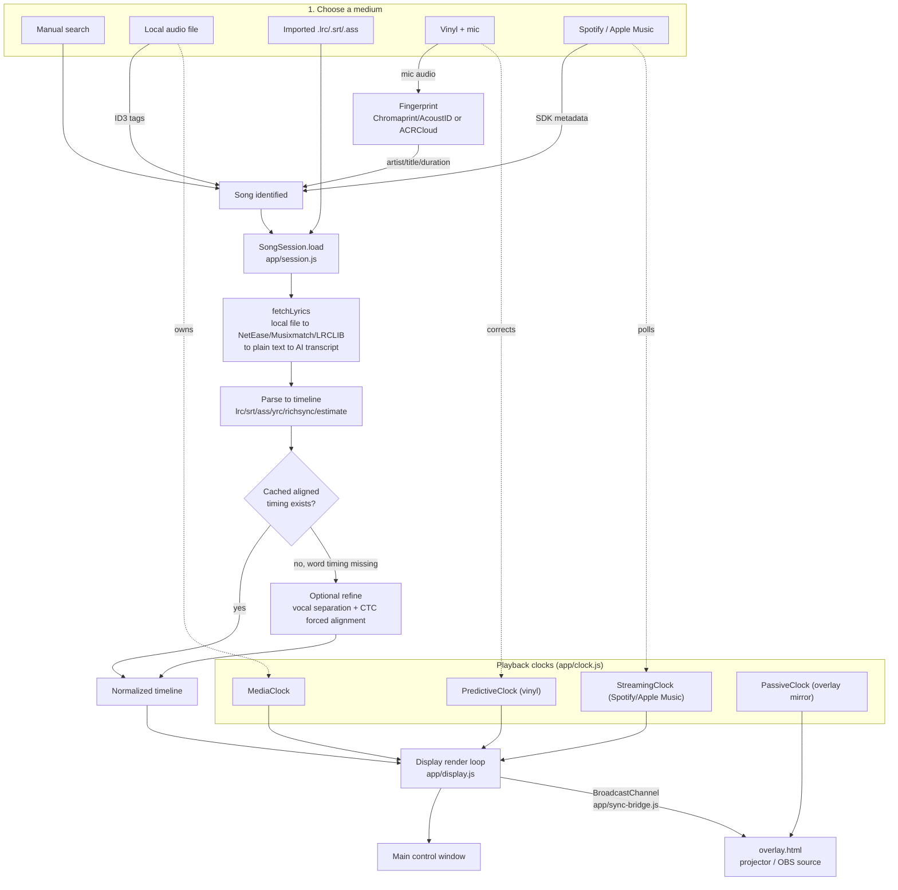

# Bar4Bar (`smart_lyric`)

Projector karaoke: every bar, every word, in sync. Mic on a record player, a local file, Spotify, or Apple Music — cinematic word-by-word highlight.

| | |
| --- | --- |
| **Author** | [Rahil Sheth](https://github.com/rsheth8) |
| **Live** | [smartlyric.vercel.app](https://smartlyric.vercel.app) (streaming / search; vinyl + projector need the desktop app) |
| **Repo** | [rsheth8/smart_lyric](https://github.com/rsheth8/smart_lyric) |
| **Stack** | Node, Electron, native tvOS (Swift), Chromaprint/AcoustID, Spotify & Apple Music SDKs |
| **Status** | Personal product. Vinyl auto-detect needs `fpcalc` + an AcoustID key. |


A projector-ready, word-by-word karaoke lyric display that follows whatever you're playing — a Spotify track, a record on a turntable, a local audio file, or a manual search — with no manual timing work.

## What this is

Bar4Bar is an app for showing synchronized, highlighted lyrics on a screen or projector while music plays, the same way karaoke or concert lyric screens work — except it figures out the timing automatically instead of requiring a pre-made karaoke file.

You tell it what's playing (or let it listen and recognize the song itself), and it:

1. Finds time-synced lyrics for that song from a chain of online lyric catalogs, or falls back to transcribing the vocals with AI if nothing exists.
2. Displays the lyrics with a moving highlight that tracks the current word or line, in real time.
3. Can push that same lyric view to a second window — a projector, TV, or an OBS browser source — for performances, parties, or streaming.

It supports several ways of "listening" to a song:

- **Manual search** — type an artist and title, load the lyrics, and play along with a built-in demo clock.
- **Local audio file** — attach an audio file; Bar4Bar reads its ID3 tags to find lyrics and syncs exactly to the file's own playback position.
- **Imported lyrics file** — bring your own `.lrc`, `.srt`, or `.ass` file, which auto-pairs with an audio file of the same name.
- **A spinning record** (desktop app only) — point a microphone at a turntable; Bar4Bar fingerprints the audio (Chromaprint/AcoustID or ACRCloud) to identify the song and estimate playback position and speed, including mid-song needle drops.
- **Spotify / Apple Music** — connect an account; Bar4Bar polls the streaming SDK for playback position and fetches matching lyrics.

## Key features

- Automatic time-synced lyrics from multiple online sources (NetEase, Musixmatch, LRCLIB), including word-level ("karaoke ball") timing where available, with graceful fallback to line-level or AI-estimated timing.
- AI transcription (Whisper, via `@huggingface/transformers`) as a last resort when no catalog has lyrics for a song, with optional Claude-based cleanup of the transcript text.
- Optional forced alignment (wav2vec2 CTC model) that refines word-level timing against the actual vocal track, and optional AI vocal separation (MDX-Net ONNX) to sharpen that alignment on dense mixes.
- Vinyl/record recognition via audio fingerprinting (AcoustID/Chromaprint for near-identical digital matches, ACRCloud for noisy ambient mic capture), plus a self-calibrating playback-rate clock that tracks turntable speed drift.
- A dedicated transparent overlay window/page for projector output or an OBS browser source, kept in sync with the main control window via `BroadcastChannel`.
- Runs identically as a desktop app (Electron, with native OS integrations) or as a plain web app (static files + a couple of serverless API routes), deployable to Vercel.
- Local caching of resolved timelines so re-loading a previously aligned song is instant.

## How it works

Bar4Bar's central idea: **the display never reads audio directly.** Every rendering frame it asks a "clock" object one question — "what second of the song are we on right now?" — and draws the highlight accordingly. Different playback sources (a local audio element, a free-running vinyl-speed estimate, a polled streaming SDK position) are all just different implementations of that same clock interface. This is what lets one display/highlight engine work identically whether you're playing a local file, a Spotify stream, or an actual record.

Step by step, from user input to lit-up lyrics:

1. **Pick a source ("medium")** — manual search, audio file, imported lyrics file, vinyl/mic, Spotify, or Apple Music (`app/mediums/*.js`). Each medium knows how to identify a song and which clock type it needs.
2. **Identify the song.** For vinyl, `app/vinyl.js`'s `VinylDetector` periodically fingerprints microphone audio via Chromaprint/AcoustID or ACRCloud (through Electron IPC into `electron/fingerprint.cjs` / `electron/acrcloud.cjs`) and reports back artist/title/duration. For streaming, the OAuth-connected SDK reports the currently playing track. For manual/file entry, the user (or ID3 tags, via `app/audio-tags.js`) supplies it directly.
3. **Fetch lyrics.** `app/session.js`'s `SongSession` calls `fetchLyrics()` (`app/providers/lyrics/index.js`), which tries, in order: a user-supplied local lyrics file, then NetEase / Musixmatch / LRCLIB catalog lookups in parallel (preferring word-level timing when duration matches), then plain-text lyric sources, and only as an absolute last resort — for local audio files, or Spotify via a separate capture path — AI transcription of the recorded vocal (`app/providers/lyrics/transcript.js`, using Whisper through `@huggingface/transformers`, with optional Claude cleanup in `electron/anthropic.cjs`).
4. **Normalize to a timeline.** Whatever format comes back (`.lrc`, `.srt`, `.ass`, NetEase `yrc`, Musixmatch richsync, plain text, or an AI transcript) is parsed by `app/providers/formats/*.js` into one common line/word timeline shape. Untimed plain text gets an estimated scroll timeline (`estimate.js`) instead.
5. **Optional refinement.** If word-level timing is missing or coarse, an optional pipeline (Electron-only) can isolate vocals (`electron/separate.cjs`, MDX-Net ONNX) and run forced alignment (`electron/align.cjs`, wav2vec2 CTC via `lib/forced-align.mjs`) to snap each word's start/end to where it's actually sung. Results are cached (`app/timeline-cache.js`) so this only has to happen once per song.
6. **Play and track position.** The chosen medium activates the matching clock (`app/clock.js`): `MediaClock` for an owned `<audio>` element, `PredictiveClock` for vinyl (free-running, periodically corrected by fresh fingerprint measurements, with drift/speed calibration), `StreamingClock` for Spotify/Apple Music (eases toward noisy polled positions, snaps on real seeks), or `PassiveClock` for a mirrored overlay window.
7. **Render.** `app/display.js` reads `clock.now()` every frame, finds the current line/word in the timeline, and updates the DOM highlight — cinematically, word by word where timing supports it.
8. **Broadcast (optional).** `app/sync-bridge.js` mirrors playback state over `BroadcastChannel` so a second window — the Electron projector window or `overlay.html` loaded as an OBS browser source — shows the identical, perfectly synced lyric view without re-deriving anything.



### Vinyl sync in more detail

`VinylDetector` periodically records a short mic chunk and fingerprints it. A fresh, reliable position measurement re-anchors `PredictiveClock`, which otherwise free-runs between measurements so the highlight never stutters; `calibrateRate()` uses pairs of measurements to estimate and smooth the turntable's actual playback rate (handling records that run slightly fast/slow), and fingerprint offset alignment handles the case of a needle dropped mid-record.

### Web vs. desktop

The same `app/` front end runs in two hosts:

- **Web** — `server.mjs` is a small zero-dependency static file server for local development (`npm run dev`), and `api/*.js` are the equivalent serverless functions for a Vercel deployment (`vercel.json` routes `/config.js`, `/api/lyrics`, `/api/richsync`, `/api/genius` to them). Vinyl detection, forced alignment, vocal separation, AI transcription, and Genius lookups are Electron/desktop-only (native fingerprinting libraries, local Whisper/ONNX models, and secrets that must stay server-side).
- **Desktop** — `electron/main.cjs` wraps the same `app/` HTML/JS in a control window plus an optional second "projector" window, and exposes the desktop-only capabilities (fingerprinting, alignment, separation, transcription, Genius, Spotify OAuth via a system-browser loopback redirect) to the renderer over IPC (`electron/preload.cjs`).

## Tech stack

- **Runtime/UI**: Vanilla JavaScript (ES modules), HTML, CSS — no front-end framework. `app/ui/router.js` and `app/ui/surface.js` handle in-app navigation and layout.
- **Desktop shell**: Electron 31, with a CommonJS main process (`electron/*.cjs`) and dynamic `import()` for ESM helpers.
- **AI/ML**: `@huggingface/transformers` (Transformers.js) for Whisper-based transcription and the wav2vec2 CTC forced-alignment model, run via ONNX (`onnxruntime-node` for desktop-only vocal separation); optional Claude (`ANTHROPIC_API_KEY`) for lyric transcript cleanup and language guessing.
- **Server**: A dependency-free Node.js HTTP server (`server.mjs`) for local dev; Vercel serverless functions (`api/*.js`, `@vercel/node`) for the deployed web build.
- **External services/APIs**: LRCLIB, NetEase, Musixmatch (richsync), Genius (scraped, best-effort), AcoustID/Chromaprint, ACRCloud, Spotify Web API/SDK, Apple MusicKit.
- **Testing**: Node's built-in `node:test` runner (`npm test`, `test/*.test.js`) — no external test framework.

## Project structure

```
app/                    Front-end renderer, shared by web and Electron
  session.js            SongSession — orchestrates loading lyrics + timeline
  clock.js              MediaClock, PredictiveClock, StreamingClock, PassiveClock
  display.js            Render + word/line highlight engine
  sync-bridge.js        BroadcastChannel state sharing (main window <-> overlay)
  timeline.js / timeline-cache.js   Timeline shape + local caching of aligned timing
  vinyl.js              VinylDetector (fingerprint polling + song detection)
  align.js              Helpers to decide if/when vocal alignment is needed
  mediums/              One module per input source (manual, audioFile, vinyl, spotify, appleMusic)
  providers/lyrics/      Catalog lookups (LRCLIB, NetEase, Musixmatch, local, plain, AI transcript)
  providers/formats/     Format parsers (lrc, srt, ass, yrc, richsync) -> common timeline, plus estimate.js
  streaming/             OAuth + SDK adapters for Spotify/Apple Music
  overlay.html/js        Transparent projector/OBS lyric surface
  styles/                CSS (tokens, shell, screens)
electron/               Electron main-process code (desktop-only capabilities)
  main.cjs               Windows, IPC handlers, Spotify OAuth loopback flow
  fingerprint.cjs / acrcloud.cjs   Audio fingerprinting for vinyl recognition
  align.cjs               CTC forced alignment (wav2vec2)
  separate.cjs / separate-worker.cjs   MDX-Net vocal separation (child process)
  transcribe.cjs          Whisper transcription
  anthropic.cjs            Claude-based lyric cleanup / language detection
lib/                    Shared ESM helpers used by both the dev server and Electron
  genius.mjs, netease.mjs, musixmatch.mjs   Lyric-source fetchers needing server-side secrets
  forced-align.mjs, stft.mjs   Signal-processing / alignment math
  lyric-cleanup.mjs, transcript-text.mjs, song-language.mjs, mdx.mjs, align-text.mjs
api/                    Vercel serverless functions (web deployment equivalents of the above)
scripts/                Manual diagnostic/check scripts (alignment, separation, live sync)
test/                   node:test unit tests, one file per module
docs/                   Design notes (alignment accuracy roadmap, sync handoff, checklist)
mockups/                Static HTML mockups
server.mjs              Local dev static file + API server
identify.py             Standalone Python mic -> Chromaprint -> AcoustID diagnostic spike
vercel.json             Vercel build/routing config for the web deployment
```

## Setup / running locally

Requires Node.js >= 18.

```sh
npm install
cp .env.example .env      # then fill in the keys you need (see below)
npm run dev                # web dev server -> http://localhost:4321
npm test                   # runs test/*.test.js via node --test
npm start                  # desktop app (Electron)
```

Environment variables (`.env`, see `.env.example` for full details on each):

| Variable | Enables |
|---|---|
| `ACOUSTID_API_KEY` | Vinyl auto-detect via Chromaprint (near-identical digital match); also needs `fpcalc` on PATH (`brew install chromaprint`) |
| `ACRCLOUD_HOST` / `ACRCLOUD_ACCESS_KEY` / `ACRCLOUD_ACCESS_SECRET` | Vinyl auto-detect via ambient mic recognition (recommended for real turntables) |
| `SPOTIFY_CLIENT_ID` / `SPOTIFY_CLIENT_SECRET` / `SPOTIFY_REDIRECT_URI` | Connect Spotify |
| `APPLE_MUSIC_DEVELOPER_TOKEN` | Connect Apple Music |
| `ANTHROPIC_API_KEY` / `ANTHROPIC_MODEL` | Claude cleanup of AI-transcribed lyrics |
| `SEPARATE_MODEL_PATH` / `SEPARATE_MODEL_URL` / `SEPARATE_MODEL_PARAMS` | Optional MDX-Net vocal separation before forced alignment |
| `GENIUS_ACCESS_TOKEN` | Plain-lyrics last resort via Genius (desktop only; scraping, best-effort) |

Keyboard shortcuts: **F** = fullscreen, **Space** = play/pause.

### Deploying the web build (Vercel, needed for Spotify)

Spotify requires an HTTPS redirect URI, so Spotify login only works from a deployed URL (or the desktop app's loopback redirect):

```sh
npx vercel
```

Then in the Vercel project's Settings -> Environment Variables, set `SPOTIFY_CLIENT_ID`, `SPOTIFY_CLIENT_SECRET`, and `SPOTIFY_REDIRECT_URI` (`https://YOUR-PROJECT.vercel.app/`, trailing slash), redeploy (`npx vercel --prod`), and add the same redirect URI in the Spotify Dashboard. Mirror `SPOTIFY_REDIRECT_URI` in your local `.env` too, since Electron reuses it. Vinyl detection and the projector output still require the desktop app (`npm start`).

### Sending output to a projector or OBS

- **Electron projector window** — a second, transparent, borderless window opened on an external display from the desktop app.
- **OBS Browser Source** — point it at `http://localhost:4321/overlay.html` with a transparent background enabled.

### Standalone fingerprint spike

`identify.py` is a separate, minimal Python script (mic -> Chromaprint -> AcoustID) used during early development to validate the fingerprinting approach outside the app:

```sh
export ACOUSTID_API_KEY=your_key_here
python identify.py
```

## Notable implementation details / design decisions

- **Clock abstraction is the core design choice.** Every playback source is reduced to `now()` / `isPlaying()`, so the rendering/highlight code (`app/display.js`) is completely decoupled from *how* position is known — vinyl fingerprinting, streaming polls, or an owned `<audio>` element all look the same to it.
- **Catalogs are tried before AI, and word-level timing is preferred but not blindly.** `fetchCatalogLyrics` prefers richer word-level sources (NetEase `yrc`, Musixmatch richsync) over line-level ones, but skips a word-level hit whose duration doesn't match the target track, so a mismatched cover/live version can't win over a correct line-level match. AI transcription (Whisper) only runs after every catalog and plain-text source has genuinely missed.
- **A user-imported lyrics file is authoritative; an auto-paired one is a fallback.** A `.lrc`/`.srt`/`.ass` file the user explicitly attached is used as-is, but one merely auto-matched by filename next to an audio file only wins if nothing with real word-level timing is found elsewhere.
- **Forced alignment and vocal separation are additive refinements, never load-bearing.** Both soft-fail to `null`/existing timing on any error (missing model, failed download, native ORT abort), so a broken ML pipeline never breaks basic lyric sync — it only forgoes the sharper word timing.
- **Electron's main process is CommonJS on purpose** — a documented Electron 31 + Node 20 ESM-loader crash on the built-in `electron` module forces `electron/main.cjs` to stay CJS, pulling in the few ESM helper modules via dynamic `import()`.
- **Spotify OAuth on desktop uses a system-browser loopback redirect** (RFC 8252 "OAuth for Native Apps") rather than an embedded webview, because Spotify (like Google) blocks/challenges OAuth inside embedded browsers.
- **Streaming position is eased, not snapped, to avoid visible jitter.** `StreamingClock` treats small poll-to-poll differences as noise (a deadband), eases toward moderate corrections, and only hard-snaps on genuine seeks/track changes — since digital playback runs at exactly real-time rate, the free-running clock between polls is already accurate.
- **Vinyl clock never jumps backward** on small corrections (only forward, or on a large error suggesting a real seek/needle drop), because a backward jump would visibly look like the lyrics rewinding.
- **Aligned timelines are cached locally** (`app/timeline-cache.js`) so the (relatively expensive) separation + forced-alignment pipeline runs at most once per song.
