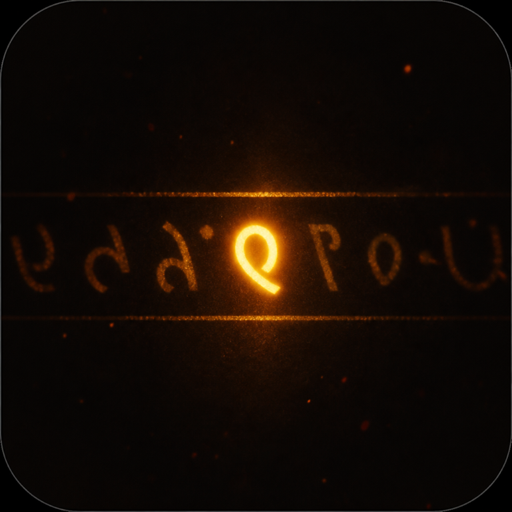

<p align="center">
  
</p>

<h1 align="center">Bar4Bar</h1>

<p align="center">
  Every bar. Every word. In sync.
</p>

<p align="center">
  <a href="https://smartlyric.vercel.app">Live</a>&nbsp;·&nbsp;<a href="https://github.com/rsheth8/smart_lyric">Source</a>&nbsp;·&nbsp;<a href="CONTRIBUTING.md">Run locally</a>
</p>

<p align="center">
  
  
</p>

<p align="center"><sub>Streaming on the live site. Vinyl + projector need the desktop app.</sub></p>

---

## Run it

```sh
npm run dev      # → http://localhost:4321  (dev server)
npm test         # unit tests (node:test)
npm start        # desktop app (Electron)
```

### Apple TV (native tvOS)

```sh
cd tvos && xcodegen generate && open Bar4BarTV.xcodeproj
cd tvos/Bar4BarCore && swift test
```

See [docs/tvos-migration.md](docs/tvos-migration.md) for MusicKit setup, `LYRICS_API_BASE`, and the Mac vs TV cut line.

Copy `.env.example` to `.env` and add keys as needed:

| Variable | Required for |
|----------|----------------|
| `ACOUSTID_API_KEY` | Vinyl auto-detect |
| `SPOTIFY_CLIENT_ID` | Connect Spotify |
| `APPLE_MUSIC_DEVELOPER_TOKEN` | Connect Apple Music |

Vinyl auto-detect also needs Chromaprint's `fpcalc` on your PATH (`brew install chromaprint`).

**F** = fullscreen · **Space** = play/pause

### Spotify setup (Vercel recommended)

Spotify requires an HTTPS redirect URI for most apps. Deploy this project, then
whitelist that URL.

1. **Deploy to Vercel**

```sh
npx vercel
```

In the Vercel project → **Settings → Environment Variables**, add:

| Name | Value |
|------|--------|
| `SPOTIFY_CLIENT_ID` | from Spotify dashboard |
| `SPOTIFY_CLIENT_SECRET` | from Spotify dashboard |
| `SPOTIFY_REDIRECT_URI` | `https://YOUR-PROJECT.vercel.app/` (trailing slash) |

Redeploy after adding env vars (`npx vercel --prod`).

2. **Spotify Dashboard → Redirect URIs** — add exactly:

`https://YOUR-PROJECT.vercel.app/`

3. **Local `.env`** — mirror the same `SPOTIFY_REDIRECT_URI` so Electron can use it too.

4. Open the Vercel URL → **Connect Spotify** → play a track anywhere.

Vinyl auto-detect / projector still need the desktop app (`npm start`).

### Ways to follow a song

1. **Manual search** — type artist + song → **Load lyrics** → **Play** (demo clock).
2. **Audio file sync** — attach a track (tags auto-fill search) → load lyrics → exact sync via `MediaClock`.
3. **Import lyrics file** — `.lrc`, `.srt`, or `.ass`; auto-pairs with audio when basenames match.
4. **Listen to a record** (desktop) — mic + Chromaprint/AcoustID fingerprinting.
5. **Spotify / Apple Music** — playback position from streaming SDK; lyrics from LRCLIB/local file.

## Outputs

- **Open projector / OBS overlay** — launches `overlay.html` (transparent lyric-only view).
- **Electron projector window** — second window on external display (desktop app).
- **OBS** — Browser Source → `http://localhost:4321/overlay.html`, enable transparent background.

## Architecture

The display never reads audio directly — it asks a **clock** "what second are we on?"
each frame. Lyrics normalize to a **timeline**; sources plug in via a provider chain.

```
app/
  session.js           SongSession orchestrator
  clock.js             MediaClock · PredictiveClock · StreamingClock · PassiveClock
  display.js           render + highlight engine
  sync-bridge.js       BroadcastChannel state for overlay/projector
  providers/
    lyrics/            local file → LRCLIB fallback chain
    formats/           LRC · SRT · ASS → timeline
  mediums/             manual · audioFile · vinyl · spotify · appleMusic
  streaming/           OAuth + SDK adapters
  overlay.html/js      OBS / projector lyric surface
electron/
  main.js              control window + projector window + config injection
  fingerprint.cjs      Chromaprint + AcoustID + fingerprint offset alignment
```

### Vinyl sync

Fingerprint offset alignment handles mid-record needle drops when AcoustID metadata
includes a reference fingerprint. `PredictiveClock.calibrateRate()` refines vinyl
speed between consecutive observations.

## Step 0 fingerprint spike

`identify.py` — standalone mic → Chromaprint → AcoustID diagnostic.

```sh
export ACOUSTID_API_KEY=your_key_here
python identify.py
```

## Contributing

PRs and issues welcome. How to run tests, env vars, and the expected layout: [CONTRIBUTING.md](CONTRIBUTING.md).

Don't commit `.env`, API keys, or personal recordings.

